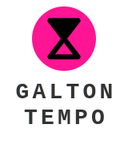

  

<h3 align="center">Rhythm from Chaos, Groove from Gravity.</h3>

  <a href="#-english">English</a> |
  <a href="#-日本語">日本語</a> |
  <a href="#-deutsch">Deutsch</a>

---

## 🇺🇸 English

### The Aesthetics of Kinetic Lag

**"Perfect timing is a lie. True groove lives in the uncertainty of the fall."**

**GALTON-TEMPO** is not just a metronome. It is a stochastic rhythm generator that explores the "physical delay" between a digital pulse and kinetic manifestation. While a standard metronome clicks with sterile precision, GALTON-TEMPO shoots particles at every beat, letting gravity and probability decide the exact moment of impact.

Inspired by the raw texture of techno and the philosophy of controlled chaos, this tool transforms the rigid 1/4 note into a living, breathing fluctuation.

### 🎛️ Features
- **BPM-Synced Emission**: 4 grains per beat, fired in TR-REC sequencer style. 16 particles per bar.
- **Stochastic Groove**: The lag between "shoot" and "hit" creates a natural, unquantized swing.
- **Seed-Based Determinism**: Every chaotic bounce is reproducible. Capture your favorite entropy and lock it.
- **Peg Sound Control**: Toggle collision sounds on/off with adjustable volume. Feel the grain hit the pegs, or silence the chaos.
- **5 Physics Presets**: Standard, Heavy Sand, Techno, Moon Gravity, Super Ball — shape the feel of every fall.

*Stop listening to the clock. Start feeling the gravity.*

---

## 🇯🇵 日本語

### キネティック・ラグの美学

**「完璧なタイミングなど、幻想に過ぎない。真のグルーヴは、落下の不確かさの中に宿る。」**

**GALTON-TEMPO** は、単なるメトロノームではありません。デジタルなパルスと物理的な発現の間に横たわる「物理的遅延（ラグ）」を探索する、確率論的リズム生成器です。無機質な精度でクリックを刻むだけの道具を捨て、重力と確率に打点を委ねる体験を。

テクノの硬質な質感と、制御されたカオスの哲学にインスパイアされたこのツールは、硬直した四分音符を、呼吸する「揺らぎ」へと変貌させます。

### 🎛️ 特徴
- **BPM同期射出**: 1拍あたり4粒、TR-RECシーケンサー方式で射出。1小節あたり16粒の粒子が降り注ぐ。
- **ストカスティック・グルーヴ**: 「射出」から「衝突」までのタイムラグが、計算では出せない天然のタメとスウィングを生む。
- **シード値による決定論**: カオスな跳ね返りはすべて再現可能。お気に入りの「エントロピー」を固定せよ。
- **ペグ音コントロール**: 衝突音のON/OFFと音量調節。粒がペグを弾く音を感じるか、カオスを静寂に包むか。
- **5つの物理プリセット**: Standard, Heavy Sand, Techno, Moon Gravity, Super Ball — 落下の手触りを自在に変える。

*時計の音を聴くのをやめろ。重力を感じろ。*

---

## 🇩🇪 Deutsch

### Die Ästhetik des kinetischen Lags

**"Perfektes Timing ist eine Lüge. Der wahre Groove lebt in der Ungewissheit des Falls."**

**GALTON-TEMPO** ist kein gewöhnliches Metronom. Es ist ein stochastischer Rhythmusgenerator, der die „physikalische Verzögerung" zwischen digitalem Puls und kinetischer Manifestation erforscht. Während ein Standard-Metronom mit steriler Präzision klickt, schießt GALTON-TEMPO bei jedem Schlag Partikel ab und lässt Schwerkraft und Wahrscheinlichkeit über den exakten Moment des Aufpralls entscheiden.

Inspiriert von der rohen Textur des Techno und der Philosophie des kontrollierten Chaos, verwandelt dieses Tool die starre Viertelnote in eine lebendige, atmende Fluktuation.

### 🎛️ Funktionen
- **BPM-synchrone Emission**: 4 Partikel pro Schlag im TR-REC-Sequenzer-Stil. 16 Partikel pro Takt.
- **Stochastischer Groove**: Die Verzögerung zwischen „Schuss" und „Aufprall" erzeugt einen natürlichen, unquantisierten Swing.
- **Seed-basierter Determinismus**: Jeder chaotische Abprall ist reproduzierbar. Halte deine Lieblings-Entropie fest.
- **Peg-Sound-Steuerung**: Kollisionssounds ein-/ausschalten mit einstellbarer Lautstärke. Fühle den Aufprall oder hülle das Chaos in Stille.
- **5 Physik-Presets**: Standard, Heavy Sand, Techno, Moon Gravity, Super Ball — forme das Gefühl jedes Falls.

*Hör auf, auf die Uhr zu hören. Fang an, die Schwerkraft zu spüren.*

---

## 🎨 Themes / テーマ

- **TEMPO**: Deep pink pulse of rhythm. / リズムの鼓動、ディープピンク。
- **NIXIE**: Amber glow of vintage Nixie tubes. / ニキシー管の残光。
- **SYSTEM**: Classic matrix green from 80s computing. / 80年代の計算機グリーン。
- **STUDIO**: Pure white for professional focus. / 清潔感のあるスタジオ・ホワイト。
- **CYBER**: Electric blue for a high-tech night. / 深い夜に映えるネオンブルー。

---

## ⚙️ Technical Specification / 技術仕様

| | |
|---|---|
| **Physics** | Custom Galton board simulation (no external physics library) |
| **Audio** | Web Audio API — beat synthesis, peg collision tones, stereo panning |
| **Rendering** | Canvas 2D, multi-pass glow, sub-pixel grain rendering |
| **Timer** | Web Worker for drift-free BPM timing |
| **Design** | Industrial Minimalism / Dark Mode Standard |
| **Series** | Tipsy Tap Studio "Stochastic-Series" Vol. 2 |

---

## Developer's Note

This is a bridge to the future. A prototype for **GALTON-NODE**.
By feeling the lag of TEMPO, you are preparing your soul for the chaos of NODE.

---

## License

This project is licensed under the [MIT License](LICENSE).

---

<b>Crafted by Tipsy Tap Studio</b>

